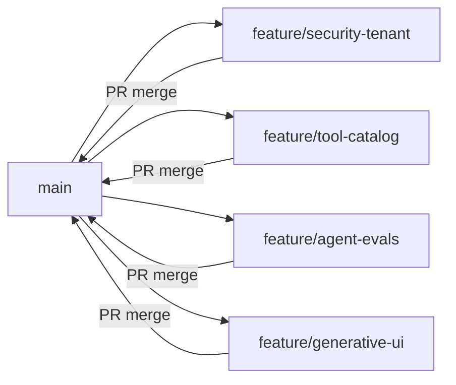

# Implementation Plan — ATS Analytics Copilot

> Master plan for the BuildWithin Product Engineer build exercise (~4 focused
> hours). Per-phase build guides: [phase1.md](phase1.md) · [phase2.md](phase2.md) ·
> [phase3.md](phase3.md) · [phase4.md](phase4.md).
>
> **Status:** Phases 1–4 are complete on fork `main`. The phase guides describe how
> each slice was built; outcomes live in [DECISIONS.md](../DECISIONS.md) and
> follow-ups in [roadmap.md](roadmap.md).

---

## Git workflow: one branch + one PR per phase

Each phase ships on its **own feature branch** and opens a **PR to `main`**. Merge
each PR before starting the next phase branch (linear history, reviewable slices).



| Phase | Branch | Focus | Build guide | Opens after |
| --- | --- | --- | --- | --- |
| **1** | `feature/security-tenant` | Database tenant isolation + role-based PII permissions | [phase1.md](phase1.md) | — |
| **2** | `feature/tool-catalog` | Scoped analytics queries + AI tool catalog | [phase2.md](phase2.md) | Phase 1 merged |
| **3** | `feature/agent-evals` | Real model wiring + Evalite benchmarks | [phase3.md](phase3.md) | Phase 2 merged |
| **4** | `feature/generative-ui` | Streaming charts/tables + `DECISIONS.md` | [phase4.md](phase4.md) | Phase 3 merged |

**Starting a phase:**

```bash
git checkout main
git pull
git checkout -b <branch-from-table>
```

**Finishing a phase:**

1. Implement per the phase build guide.
2. Run verification (`pnpm typecheck`, phase-specific checks).
3. Commit on the feature branch.
4. Open PR → `main` (suggested PR titles are in each phase doc).
5. Merge, then start the next branch from updated `main`.

> Do **not** continue stacking all phases on one long-lived branch. The README asks
> for a PR with commits that tell a story — one PR per phase keeps each review
> focused.

---

## What we're building

A multi-tenant B2B copilot that chats with **one workspace's** recruiting data,
calls tools, and renders charts/tables.

**Hard requirements:**

1. **Tenant isolation** — no tool ever returns another workspace's rows.
2. **Permissions** — an `analyst` never receives candidate PII (name/email/phone).

**Guiding principle:** **right by construction** — scoping and PII gating live in
the query layer so they can't be forgotten as the catalog grows.

---

## Phased execution (summary)

### Phase 1 — `feature/security-tenant` (Hour 1)

- Implement `canReadColumn`, `candidateColumns(role)`, `assertCanReadPII` in
  [src/db/permissions.ts](../src/db/permissions.ts).
- Document invariants in [src/db/analytics.ts](../src/db/analytics.ts); keep
  `scopeWhere` as the only scoping funnel.

### Phase 2 — `feature/tool-catalog` (Hour 2)

- Add scoped query fns + register tools in [src/agent/tools.ts](../src/agent/tools.ts).
- All tool inputs optional (mock calls with `{}`).

### Phase 3 — `feature/agent-evals` (Hour 3)

- Wire real model via `.env.local` (mock stays default).
- Tenant-isolation + permission evals in [evals/copilot.eval.ts](../evals/copilot.eval.ts).

### Phase 4 — `feature/generative-ui` (Hour 4)

- `display`-driven UI in [src/app/page.tsx](../src/app/page.tsx).
- Complete [DECISIONS.md](../DECISIONS.md) incl. "Working with the agent" note.

---

## Definition of done (full exercise)

- [x] Four PRs merged to `main` (one per phase branch).
- [x] Hard requirements proven by evals (Phase 3) and visible in UI (Phase 4).
- [x] `DECISIONS.md` complete.
- [x] `pnpm typecheck`, `pnpm test`, `pnpm eval`, `pnpm build` green on `main`.

---

## Quick verification (on `main`)

1. `pnpm install && pnpm db:seed && pnpm dev` — chat with workspace/role toggles.
2. `pnpm test` (28 cases), `pnpm eval` (11 cases), `pnpm build`.
3. Real-model demo: copy `.env.example` → `.env.local`, set `AI_PROVIDER` + API key.
