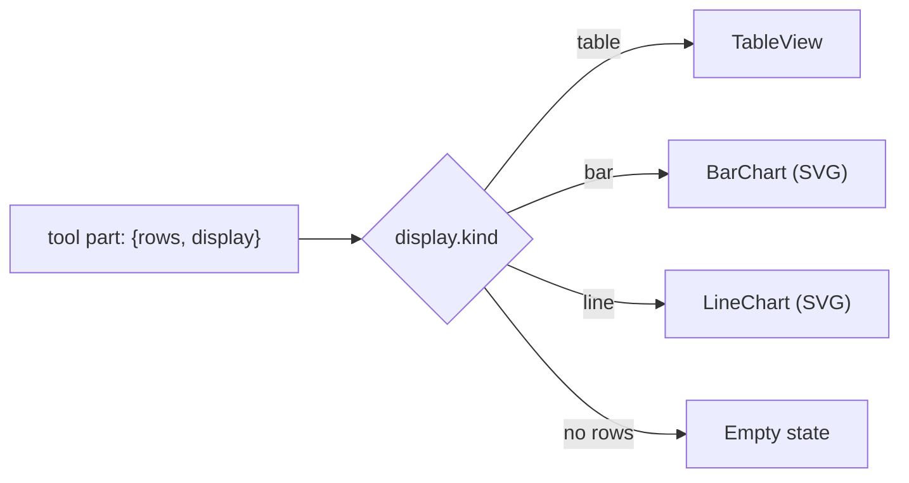

# Phase 4 — Generative UI + DECISIONS.md

> Build guide for turning tool results into real, streaming chart/table components,
> and for the written deliverable. This is the "product taste" phase — a copilot
> you'd actually want to use — plus the write-up the reviewers dig into.

**Where it fits:** Phase 4 of [docs/implementationPlan.md](implementationPlan.md).
Depends on Phases 1–3 (tools return `{ rows, display }`; real model + evals in place) — merge
[`feature/agent-evals`](implementationPlan.md#git-workflow-one-branch--one-pr-per-phase) before starting.

## Git workflow

| Item | Value |
| --- | --- |
| **Branch** | `feature/generative-ui` |
| **Focus** | Generative UI (streaming charts/tables) + `DECISIONS.md` |
| **Base** | `main` (after Phase 3 PR is merged) |
| **PR target** | `main` |
| **Opens after** | `feature/agent-evals` merged |

**Workflow:** `git checkout main && git pull`, then `git checkout -b feature/generative-ui`.

**Acceptance:**
- Tool results render as `table` / `bar` / `line` per the `display` hint, with
  loading / empty / error states.
- Switching role/workspace visibly changes results (PII hidden for analyst).
- `DECISIONS.md` complete, including the "Working with the agent" note.
- `pnpm build` green.

---

## Files touched

| File | Change |
| --- | --- |
| [src/app/page.tsx](../src/app/page.tsx) | Replace stub `ToolCall` / `RowsTable` with a `display`-driven renderer (table/bar/line + states). |
| [src/agent/artifact.ts](../src/agent/artifact.ts) | *(only if needed)* extend `Display` — current `table`/`bar`/`line` should suffice. |
| [DECISIONS.md](../DECISIONS.md) | Fill all sections incl. the agent note. |

---

## The rendering contract

Every tool returns `{ rows, display }` where `display.kind` is `table | bar | line`
(see [src/agent/artifact.ts](../src/agent/artifact.ts)). The UI already receives
these on `tool-*` message parts; today `RowsTable` renders everything as a bare
table (see [src/app/page.tsx](../src/app/page.tsx) lines 194-248). We switch on
`display.kind` so each tool renders correctly with **no per-tool UI code**.



---

## Design decisions (why)

1. **Dependency-light charts.** Tailwind + inline SVG, no charting library. Keeps
   the bundle small and the time box safe; the data shapes are simple (categorical
   counts, a weekly series). Note "richer viz lib" as a next step in `DECISIONS.md`.
2. **One dispatcher component** keyed on `display.kind` so adding a tool never
   touches the UI — it just returns a known `display`.
3. **Explicit states.** `calling…` (streaming), `result`, empty (`No rows`), and
   `error` (`output-error`) — the stub only half-handles these.
4. **Numeric coercion at the edge.** PGlite `count()`/`avg()` can arrive as strings;
   coerce with `Number(...)` in the chart layer so bars scale correctly.

---

## Step 1 — Replace the tool-result renderer in `src/app/page.tsx`

Keep the existing `ToolPart` type and the `calling / result / error` shell
(lines 186-212); swap the body to dispatch on `display.kind`.

### 1a. Dispatcher

```tsx
function ToolResult({ output }: { output?: { rows?: Row[]; display?: Display } }) {
  const rows = output?.rows ?? [];
  const display = output?.display;
  if (rows.length === 0) return <p className="mt-1 text-gray-400">No rows.</p>;

  switch (display?.kind) {
    case "bar":
      return <BarChart rows={rows} x={display.x} y={display.y} title={display.title} />;
    case "line":
      return <LineChart rows={rows} x={display.x} y={display.y} title={display.title} />;
    case "table":
    default: {
      const columns =
        display?.kind === "table" ? display.columns : Object.keys(rows[0]);
      return <TableView rows={rows} columns={columns} />;
    }
  }
}
```

Wire it into `ToolCall` in place of `<RowsTable output={p.output} />`:

```tsx
{done && <ToolResult output={p.output} />}
```

### 1b. TableView (keep it, lightly polished)

Reuse the existing table markup from `RowsTable` (lines 214-248): header from
`columns`, first ~8 rows, `String(row[c] ?? "")` cells. Rename to `TableView` and
accept `{ rows, columns }`.

### 1c. BarChart (inline SVG)

```tsx
function BarChart({ rows, x, y, title }: { rows: Row[]; x: string; y: string; title: string }) {
  const data = rows.map((r) => ({ label: String(r[x] ?? ""), value: Number(r[y] ?? 0) }));
  const max = Math.max(1, ...data.map((d) => d.value));
  return (
    <figure className="mt-2">
      <figcaption className="mb-1 text-xs font-medium text-gray-600">{title}</figcaption>
      <div className="space-y-1">
        {data.map((d) => (
          <div key={d.label} className="flex items-center gap-2 text-xs">
            <span className="w-24 shrink-0 truncate text-gray-500">{d.label}</span>
            <div className="h-3 flex-1 rounded bg-gray-100">
              <div
                className="h-3 rounded bg-gray-800"
                style={{ width: `${(d.value / max) * 100}%` }}
              />
            </div>
            <span className="w-8 shrink-0 text-right tabular-nums text-gray-600">{d.value}</span>
          </div>
        ))}
      </div>
    </figure>
  );
}
```

CSS-bar approach avoids SVG axis math and reads cleanly for categorical counts.

### 1d. LineChart (inline SVG)

```tsx
function LineChart({ rows, x, y, title }: { rows: Row[]; x: string; y: string; title: string }) {
  const data = rows.map((r) => ({ label: String(r[x] ?? ""), value: Number(r[y] ?? 0) }));
  const max = Math.max(1, ...data.map((d) => d.value));
  const W = 280, H = 80, pad = 4;
  const pts = data.map((d, i) => {
    const px = pad + (i * (W - 2 * pad)) / Math.max(1, data.length - 1);
    const py = H - pad - (d.value / max) * (H - 2 * pad);
    return `${px},${py}`;
  }).join(" ");
  return (
    <figure className="mt-2">
      <figcaption className="mb-1 text-xs font-medium text-gray-600">{title}</figcaption>
      <svg viewBox={`0 0 ${W} ${H}`} className="w-full">
        <polyline fill="none" stroke="currentColor" strokeWidth="1.5" points={pts} className="text-gray-800" />
      </svg>
      <div className="mt-1 flex justify-between text-[10px] text-gray-400">
        <span>{data[0]?.label}</span>
        <span>{data[data.length - 1]?.label}</span>
      </div>
    </figure>
  );
}
```

### 1e. States

- **Loading / streaming:** the existing `· calling…` label already shows before
  `output-available`. Keep it.
- **Empty:** dispatcher returns `No rows.` when `rows.length === 0`.
- **Error:** existing `errored` branch renders `p.errorText` in red — keep; ensure
  tool `execute` errors surface as `output-error` (AI SDK does this by default).

---

## Step 2 — Fill `DECISIONS.md`

Complete every section of [DECISIONS.md](../DECISIONS.md) (currently prompts).
Keep it brief — reviewers read for trade-offs, not completeness. Cover:

- **Overview** — what's built and its state (note anything half-done on purpose).
- **Architecture & key decisions:**
  - *Tool catalog* — the 6 tools, granularity (one question each), optional inputs.
  - *Query layer* — `ctx`-first, `scopeWhere` funnel, composable fns.
  - *Tenant scoping* — impossible to forget: `scopeWhere` + `ctx`-first invariant.
  - *Permissions* — `candidateColumns(role)` makes analyst PII **unrepresentable**,
    not post-filtered; `assertCanReadPII` guard.
  - *Generative UI* — `display`-driven dispatcher; SVG/Tailwind charts.
- **Model & agent** — provider/gateway chosen + why; loop control (`stepCountIs`),
  tool-error handling, stop strategy.
- **Benchmarks** — what the isolation/permission evals assert and the regression
  proof (breaking scope/PII turns them red).
- **Trade-offs & cuts** — e.g. no charting lib, optional tRPC mirrors skipped,
  answer-quality eval best-effort; what you'd do with another day.
- **Working with the agent** (required) — what you delegated (boilerplate queries,
  chart scaffolding), where it was wrong and you caught it (e.g. PII post-filtering
  vs. column-gating; required tool params breaking the mock), what you'd never let
  it decide (the scoping/PII contract).
- **Hours** — rough time spent.

Also confirm the agent config is committed — [CLAUDE.md](../CLAUDE.md) is present.

---

## Step 3 (optional stretch — pick at most one)

Per the README, a written plan counts as much as code. If time allows, prefer a
**typed structured answer** the agent emits (small, complements the UI) — otherwise
document the choice (deploy / resumable streams / caching / rate limiting) in
`DECISIONS.md` as a plan.

---

## Verification

```bash
pnpm dev        # exercise the UI
pnpm build      # production build must pass
pnpm typecheck
```

What to assert:
- Ask questions hitting each tool → bar/line/table render correctly, numbers scale.
- Toggle **role** to `analyst` → `list candidates` shows no name/email/phone columns.
- Toggle **workspace** Brightwave ↔ Meridian → results change; conversation resets.
- Force an error path (e.g. temporarily throw in a tool) → red error state renders.
- `pnpm build` succeeds.

---

## Definition of done

- [ ] `display`-driven dispatcher renders table/bar/line with no per-tool code.
- [ ] Loading / empty / error states handled.
- [ ] Numeric coercion so PGlite string counts scale correctly.
- [ ] Role/workspace switch visibly reflected; analyst sees no PII in the UI.
- [ ] `DECISIONS.md` complete incl. "Working with the agent" note; `CLAUDE.md` committed.
- [ ] `pnpm build` + `pnpm typecheck` green.

---

## Phase commit message

```
feat(ui): render tool results as streaming charts/tables
```

**PR title (suggested):** `feat(ui): generative UI + DECISIONS.md`

**Branch:** `feature/generative-ui` → `main`
